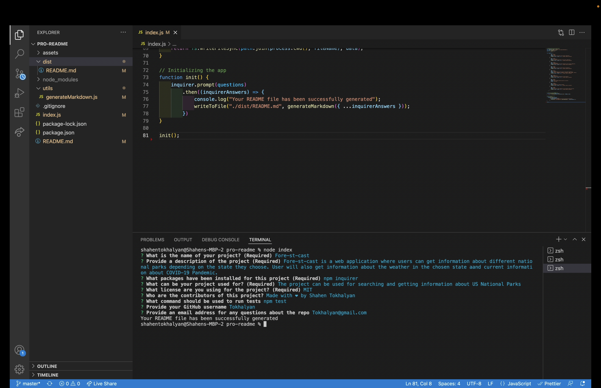

# Pro README Generator

Walkthrough Video: 

## User Story 
- AS A developer
- I WANT a README generator
- SO THAT I can quickly create a professional README for a new project

----------------------------------------------------------------------

- GIVEN a command-line application that accepts user input
- WHEN I am prompted for information about my application repository
- THEN a high-quality, professional README.md is generated with the title of my project and sections entitled Description, Table of Contents, Installation, Usage, License, Contributing, Tests, and Questions
- WHEN I enter my project title
- THEN this is displayed as the title of the README
- WHEN I enter a description, installation instructions, usage information, contribution guidelines, and test instructions
- THEN this information is added to the sections of the README entitled Description, Installation, Usage, Contributing, and Tests
- WHEN I choose a license for my application from a list of options
- THEN a badge for that license is added near the top of the README and a notice is added to the section of the README entitled License that explains which license the application is covered under
- WHEN I enter my GitHub username
- THEN this is added to the section of the README entitled Questions, with a link to my GitHub profile
- WHEN I enter my email address
- THEN this is added to the section of the README entitled Questions, with instructions on how to reach me with additional questions
- WHEN I click on the links in the Table of Contents
- THEN I am taken to the corresponding section of the README

## Description
- Pro README Generator is a command-line application that accepts user input
- All interaction with the user goes thru the terminal
- When users runs the application prompt questions will be asked.
- User will be asked to enter:
1. Title of the project
2. Description of the project
3. What packages have been installed for the project
4. What can the application be used for
5. What license is the user using for the project
6. Information about the creator/creators of the project
7. How to test the application
8. Email address

## Instructions
- Run the code in terminal (node index)
- Answer the questions about the project
- After all the questions message 'Your README file has been successfully generated' will appear
- The new README.md file will be generated in the dist/ folder

## Build with 
- Node.js

## Packages Used
- Inquirer
- Path 

## Contribution 
- Made with ❤ by Shahen Tokhalyan

